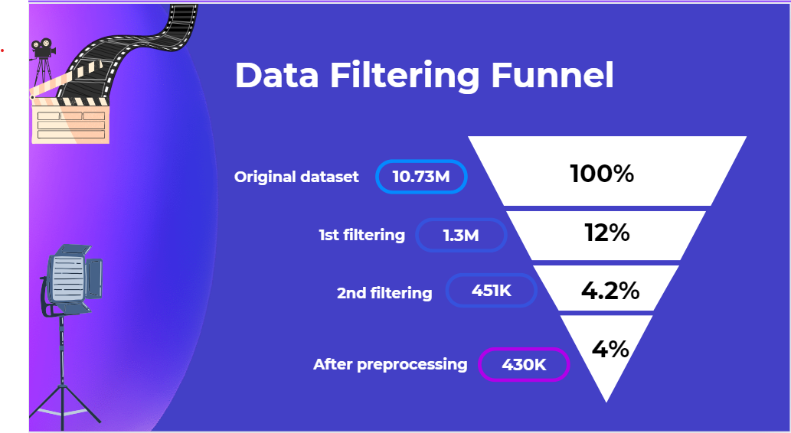
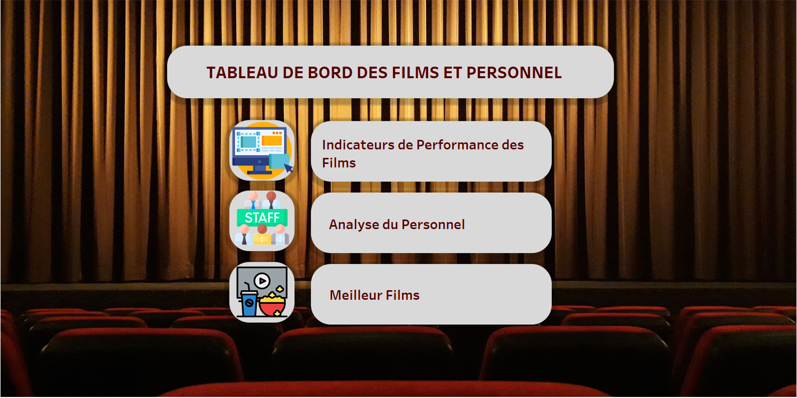
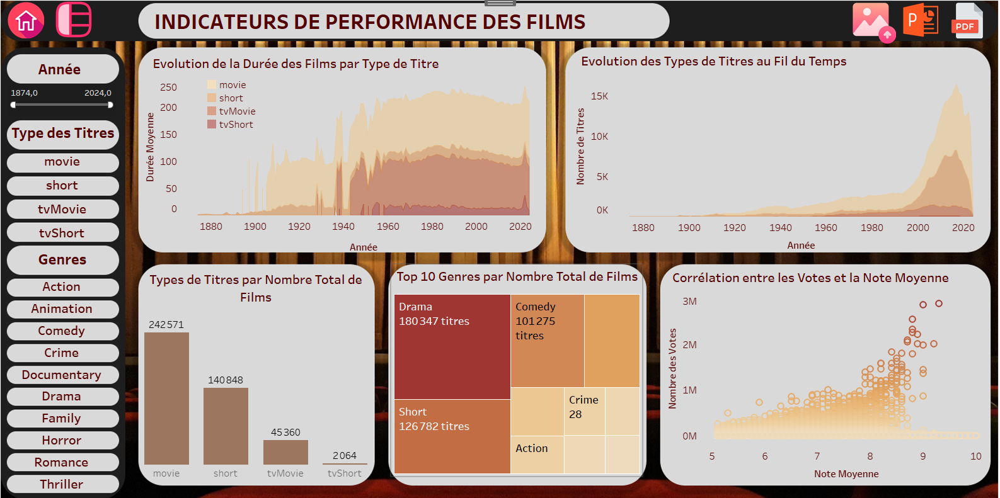
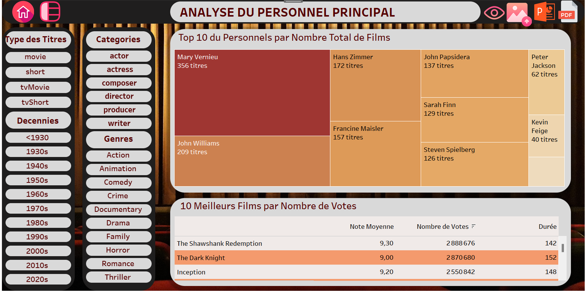
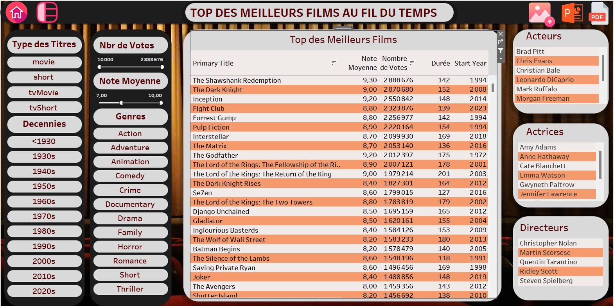

# The Movie Recommendation System
## by Halil Ibrahim Celikel and Mai Tran

## Summary of the Project

This is a project I implemented with my classmate Mai Tran at Wild Code School, where i learnt to become a data analyst. Our target is to create the  MRF - Movie Recommendation System which will recommend similar titles to user's given title according to Genres, popularity, Duration, etc. 
We started with 10.73 millions titles that we explored to understand the content of all the given datasets. We filtered to down-size into a dataset of 450k titles. We then clean and remove missing values to get a final one with 430k titles.

About the creation of the recommendation system, we first convert all the text values into numeric values by using LabelEncoder for column 'Type' and method which converted each category of column 'Genres' into a label with binary values.
Since this is a non-supervised model, we passed the step 'model traing' by going directly to the prediction of NearestNeighbors, an unsupervised learner for implementing neighbor searches.
We then tried to change the hyperparameter to get our model better but we dont' see much improvement so we sorted values by setting the weight on Votes and Genres.

## The files of the project

We used the files in the following link:

https://datasets.imdbws.com/

## Dashboard of the Project

We created a dashboard on Tableau Public Software which explains the content of the seven datasets of the project. The screenshots of the dashboard are as follows:
1. Home Page

2. Basic Indicators

3. The Crew Analysis

4. The Movies List

The link of dashboard of the project : 'https://public.tableau.com/app/profile/halil.ibrahim.celikel/viz/Projet2_tableau/Pagedaccueil'

## Files of the project

~~~~~
- poster.csv : Contains the links of the film posters.
- return_movies.csv : Contains the data of the project.
- ml.py : Contains the codes of the research.
- requirements.txt : Contains the versions of the modules used for the project. I have to add this file to publish it on streamlit.
- 
~~~~~

The link of streamlit page of the recommendation system: '(https://projectfilmreccom-dk3ib5yqhynkce3bc6igfd.streamlit.app/)'

